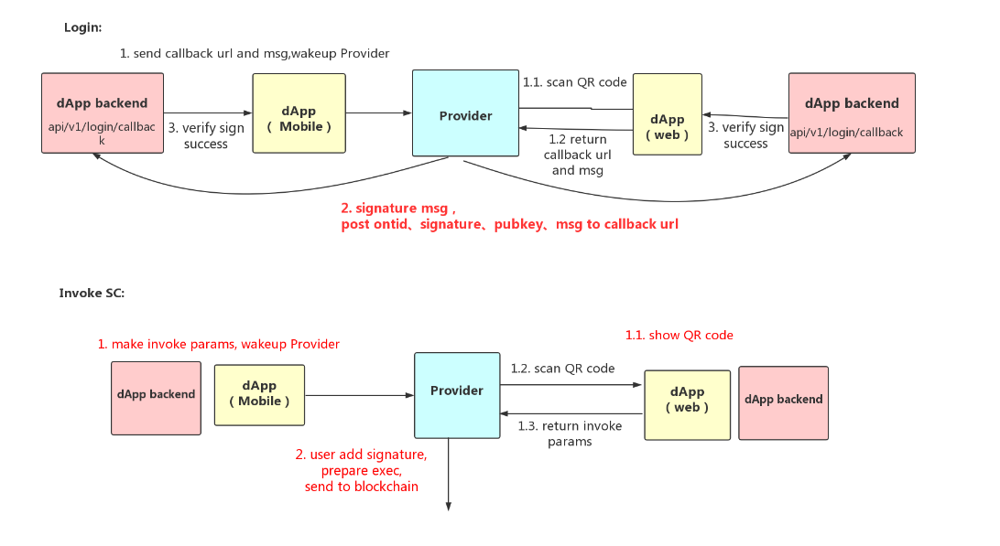

English | [中文](README_CN.md)

# dapi-mobile usage scene description

The mobile dAPI specification document includes three scenarios: wake-up, scan code, and open H5 DApp in the wallet. Wallet that already supports dAPI[MATH](http://www.mathwallet.org/en/)、[Onion](http://onion.fun/). For docking, please refer to the corresponding docking document. Please see the details in [CEP1](https://github.com/ontio-cyano/CEPs/blob/master/CEPS/CEP1.mediawiki)

Reference wallet download link: http://101.132.193.149/files/app-debug.apk

* [Wallet docking - open DApp in wallet](en/WalletDocking-wallet-open-DApp_en.md)
* [Wallet docking - scan QR code](en/WalletDocking-scan-qrcode_en.md)
* [DAPP docking - open DApp in wallet](en/DAppDocking-Wallet-Opens-DApp.md)
* [DAPP docking - QR code](en/DAppDocking-QRcode.md)
* [DAPP docking - use chrome extension wallet](en/DAppDocking-use%20chrome%20extension%20wallet.md)

## Scenario 1 and 2: Wake up, scan the QRcode

##### Login, call smart contract

##### Call smart contract when not logged in

## Scenario 3: Open H5 DApp in the wallet

1. Open DApp in Provider
2. Get account or get identity
3. Login DApp
4. DApp Invoke smart contract

## DEMO

Mobile version of Cyano wallet source link [cyano-android](https://github.com/ontio-cyano/cyano-android),[cyano-ios](https://github.com/ontio-cyano/cyano-ios)。

H5 DApp DEMO: [mobile-dapp-demo](https://github.com/ontio-cyano/mobile-dapp-demo)

### Open DApp in Provider

Open DApp in wallet: http://101.132.193.149:5000/#/

  

### Get account or get identity

DApp login If you do not need to verify the user identity, directly query the account or identity information:

  
  

### Login DApp

DApp login if you need to verify the user's identity: DApp sends a message to the wallet signature, DApp verification signature.

  
  
  

### DApp Invoke smart contract

DApp calls the contract:
1. the user signs the pre-execution contract.
2. the user confirms and sends the transaction,.
3. returns the transaction hash to DAPP.

  
  
  
   

